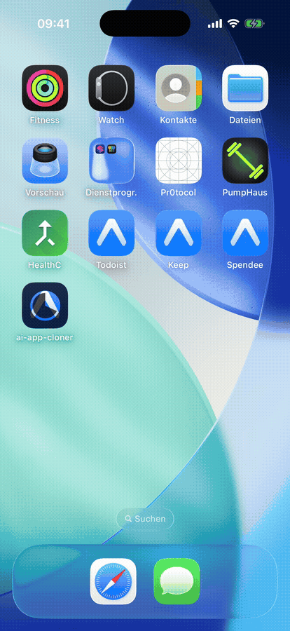
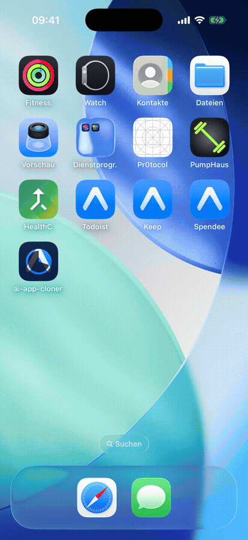
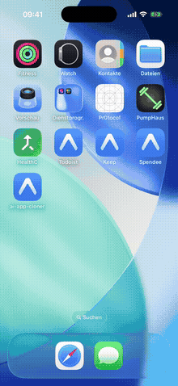
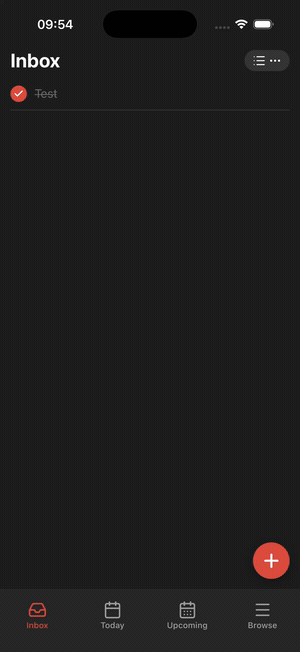
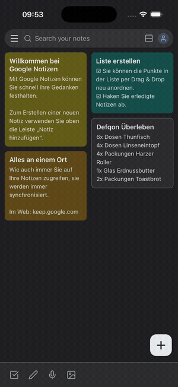
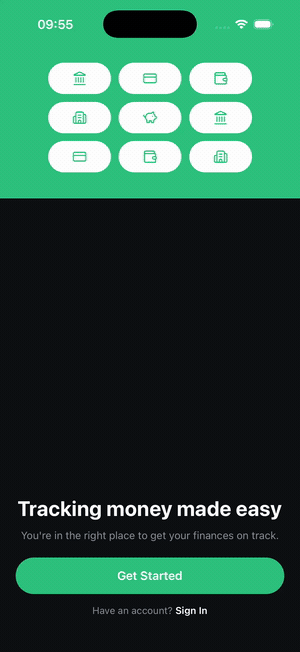

<div align="center">

# 📱 ai-app-cloner

### Give it screenshots of an app. Get a React Native app back.

[](LICENSE)
[](https://github.com/Birkenpapier/ai-app-cloner/stargazers)
[](https://github.com/Birkenpapier/ai-app-cloner/actions/workflows/ci.yml)

[](CONTRIBUTING.md)

You point your coding agent at a folder of screenshots. It works out the screens,
the navigation, and the design system, then writes a runnable Expo / React Native
project that reproduces them.

<p>
  
  &nbsp;
  
  &nbsp;
  
</p>
<p>
  
  &nbsp;
  
  &nbsp;
  
</p>

<sub>Six apps rebuilt from screenshots, running natively on the iOS 26 simulator.
You send and edit messages, rename items in place, move cards across a board, delete, and react.
It all persists on device. These are working apps, not static mockups.</sub>

<br /><br />

**[▶ See a clone running in 2 minutes](#see-a-clone-running-2-minutes)** &nbsp;·&nbsp; ⭐ Star it if it's useful. That's how the next person finds it.

</div>

---

## See a clone running (2 minutes)

No coding agent and no MCP required. Every `demo/*` branch is a finished clone that
boots on its own:

```bash
git clone https://github.com/Birkenpapier/ai-app-cloner
cd ai-app-cloner && npm install
git checkout demo/discord       # or: meistertask · mindmeister · todoist · keep · spendee
npm run web                     # opens the clone in a browser tab
```

Add a task, rename it in place, drag it to another board column, then reload the tab.
Your changes are still there. Run `npm run verify` to replay those flows headlessly and
screenshot every screen. When you're ready to build your **own** clone from screenshots,
head to [Quickstart](#quickstart).

## Why screenshots

A website hands you its source. Open the dev tools and the DOM, the CSS, the fonts,
and the asset URLs are all sitting right there. A phone app gives you none of that.
There is no markup to read and no stylesheet to copy, only the pixels on the screen.

So screenshots are the input, because they are the one thing you can capture from
any app without jailbreaking it, decompiling it, or installing anything. The same
folder of PNGs works whether the app runs on iOS or Android.

The hard part is that an image has no numbers in it. You cannot read "16px padding"
off a screenshot. That is why the core of the tool is a diff loop: it builds a
screen, renders it, screenshots its own output, compares that against your
screenshot, and fixes the differences. It repeats until the two match. That loop is
doing the measuring the DOM would have handed you for free on the web.

## How this differs from web cloners

This is the mobile counterpart to
[JCodesMore/ai-website-cloner-template](https://github.com/JCodesMore/ai-website-cloner-template)
(~26k ⭐), and the difference *is* the point:

| | Web cloner | ai-app-cloner (this) |
| --- | --- | --- |
| Input | a live URL | a folder of screenshots |
| Source of truth | the **DOM**: exact CSS, fonts, real asset files, for free | **pixels**: no numbers, no files |
| Recovering the styling | read `getComputedStyle` | **render → screenshot → diff → fix**, looped until it matches |
| Assets | downloaded from the page | re-created (icons via lucide) or cropped raster |
| Targets | websites | any phone app, iOS or Android, nothing to install |

The web version starts from an answer key. Here there isn't one, so the hard part
(measuring) becomes the engine instead of a footnote.

## Quickstart

**Prerequisites:** Node 18+ · a skill-capable AI coding agent (Claude Code is the
reference) · a browser-automation MCP (Chrome / Playwright / Puppeteer). The diff loop
screenshots the clone *through* that MCP, so it can't run without one.

```bash
git clone https://github.com/Birkenpapier/ai-app-cloner
cd ai-app-cloner
npm install
npx playwright install chromium   # one-time, used by npm run verify
npm run web                       # the blank template should boot in a browser tab
git checkout -b my-clone          # the clone builds into this repo, so keep main pristine
```

Then, inside your coding agent (Claude Code is the reference setup):

1. Connect a browser automation MCP (Chrome, Playwright, or Puppeteer). The diff loop
   cannot run without it, since it is how the agent screenshots the clone while it builds.
2. Drop screenshots into `docs/screenshots/`. See
   [`docs/screenshots/README.md`](docs/screenshots/README.md) for what to capture and how
   to name files so the agent can tell one screen from another.
3. Run `/clone-app`.

Want to see a finished result first? Each `demo/*` branch holds a complete clone:
`git checkout demo/discord` (or `demo/meistertask`, `demo/mindmeister`, `demo/todoist`, `demo/keep`, `demo/spendee`).

## Works in these agents

The `/clone-app` skill is generated for every major AI coding agent from one source
of truth (`.claude/skills/clone-app/SKILL.md` for the command, `AGENTS.md` for the
project rules). After editing the source, run `node scripts/sync-skills.mjs` and
`bash scripts/sync-agent-rules.sh` to regenerate the per-agent files.

| Agent | How it runs |
| --- | --- |
| Claude Code | `/clone-app` (reference implementation) |
| Codex CLI | `/clone-app` |
| Cursor | `/clone-app` command |
| Windsurf | `/clone-app` workflow |
| Gemini CLI | `/clone-app` |
| GitHub Copilot | `.github/` skill + instructions |
| Cline | reads `.clinerules` |
| Roo Code | reads `AGENTS.md` |
| Continue | `/clone-app` command |
| OpenCode | `/clone-app` |
| Amazon Q | `clone-app` agent |
| Augment Code | `/clone-app` command |
| Aider | reads `AGENTS.md` |

Claude Code is the only one verified end to end so far. The rest use each agent's
documented config format, generated from the same source. Reports from other agents
are welcome.

## Install as a Claude Code plugin

Rather than cloning the repo to get the skill, you can install `/clone-app` as a
Claude Code plugin and have it available in any project:

```bash
claude plugin marketplace add Birkenpapier/ai-app-cloner
claude plugin install ai-app-cloner@ai-app-cloner
```

`/clone-app` is then available everywhere. One thing to keep in mind: the skill builds
into an Expo / React Native scaffold, so run it inside a clone of this repo (the blank
canvas it fills in) or an existing Expo project. The skill's pre-flight checks for the
scaffold and tells you if it is missing.

## Where the output goes

The repo you clone is a blank Expo app. Running `/clone-app` fills it in:

- screens go into `src/app/` (Expo Router)
- components go into `src/components/`
- the design tokens go into `tailwind.config.js` and `src/lib/tokens.ts`
- the agent's analysis (screen map, navigation graph, per-screen specs) goes into `docs/research/`

So the output *is* this project, now holding your clone. There is no separate export
step. If you would rather see a finished result before running anything, each
`demo/*` branch contains one complete clone.

## How it works

```
screenshots/  ──▶  cluster into     ──▶  infer navigation  ──▶  app-spec.json
(app states)       screens & states      graph (tabs/stack)      (the IR)
                                                                      │
        ┌─────────────────────────────────────────────────────────┘
        ▼
   foundation        per-screen spec        visual-diff loop        assembled
   (tokens, nav)  ▶  + builder agents   ▶   render→shot→diff→fix  ▶  Expo app
                     (parallel, worktrees)   (until it matches)
```

The whole engine is one file written in plain English:
[`.claude/skills/clone-app/SKILL.md`](.claude/skills/clone-app/SKILL.md).

Partway through, it writes `app-spec.json`, a description of the app (tokens,
navigation, screens, states) that never mentions React Native. That is on purpose.
The RN generator reads it today; the native targets on the roadmap will read the
same file. Its shape is documented in
[`docs/research/app-spec.schema.json`](docs/research/app-spec.schema.json), with a
worked [example](docs/research/app-spec.example.json).

## The demos

The clones at the top are built from screenshots of real apps, so you can judge the
output against something you already know. MeisterTask and MindMeister were rebuilt
straight from their App Store screenshots:

| Clone | Original | What it shows off |
| --- | --- | --- |
| Discord | [Discord](https://discord.com) | the dark server rail + channel list, a chat where you send, edit, delete and react to messages, plus DMs you can search, all persisted |
| MeisterTask | [MeisterTask](https://www.meistertask.com) | a gradient-header agenda, a kanban board where you drag cards between columns and swipe to delete, task detail with an editable title and comments you post, automations |
| MindMeister | [MindMeister](https://www.mindmeister.com) | an outline editor where you rename nodes in place, add and delete branches with undo, a maps grid, comments, favorites you toggle |
| Todoist | [Todoist](https://todoist.com) | tab navigation, a task list, add-task that saves on device |
| Keep | [Google Keep](https://keep.google.com) | a notes grid, a note editor, labels |
| Spendee | [Spendee](https://www.spendee.com) | tabs, and an expense you log that updates the running balance |

Each `demo/*` branch (`demo/discord`, `demo/meistertask`, `demo/mindmeister`,
`demo/todoist`, `demo/keep`, `demo/spendee`) holds one complete clone. They exist to
demonstrate the tool, not to be shipped. See [Legal and ethics](#legal-and-ethics).

## Backend mode (v2.0)

The screenshots already imply a data model if you read them structurally: a list is a table,
the fields on a card are its columns, and a row that opens a detail view is a foreign-key hint.
Backend mode reads that model out of the same screenshots and generates a typed data layer for
the clone. It is opt-in. A default `/clone-app` run is unchanged; you turn it on with
`/clone-app --backend=mock`.

The IR (`app-spec.json`) gains an optional `dataModel` section (entities, fields, types, enums,
FK hints), and a pure-Node generator turns it into a local backend under `src/backend/generated/`:

```bash
npm run gen:backend
```

You get a **Drizzle schema** (the type source of truth), **drizzle-zod** validators,
**in-process tRPC CRUD routers** (called in-process, no HTTP), a **Repository** seam over the
existing on-device AsyncStorage store (that is the persistence), and typed `use<Table>()` hooks.
Be clear on what this tier is: it is typed, local, and offline. There is no server process, no
network, and no auth here.

Proof that it round-trips: the shipped Notes example on `main` passes `npm run verify`, it creates
a row through the tRPC API, renders it, and the row survives a reload. It also holds up on a real
app. Branch `demo/meistertask-backend` carries a 7-entity model reverse-engineered from
MeisterTask's App Store screenshots, verify-green at 9/9 flows, including posting a comment through
the generated tRPC API.

The honest ceiling: expect roughly **60-80%** of the schema. The inferred model is a reviewable
proposal, not ground truth. Recovered relations are emitted as nullable hint columns, never real
database foreign keys, and the completion report names every guess and every gap. Real Postgres on
Supabase, Supabase Auth, and starter Row-Level Security are the next tier, **v2.1**, which is not
shipped yet. See [ROADMAP.md](ROADMAP.md).

## Two modes

| Mode | Input | Fidelity | Notes |
| --- | --- | --- | --- |
| **Screenshots** (the main use) | a folder of app-state screenshots | visual parity via the diff loop | any app, iOS or Android, nothing to install |
| **Web → RN** (bonus) | a web app URL | exact, from the DOM and real assets | for turning a web app into React Native |

## Stack

Expo SDK 56, Expo Router (file-based screens), React Native 0.85, NativeWind
(Tailwind syntax), TypeScript strict.

## Roadmap

Each stage reads the same `app-spec.json`, so a new target is a new code generator,
not a new pipeline. Full detail in [ROADMAP.md](ROADMAP.md).

| Version | Input | Output | Status |
| --- | --- | --- | --- |
| **v1** | screenshots of an app | Expo / React Native (data mocked on device) | ✅ shipping now |
| **v1** | a web app URL | Expo / React Native | ✅ bonus mode |
| **v2.0** | screenshots of an app | a typed local + offline data layer + API (Drizzle + tRPC), inferred from the screens | ✅ shipping now |
| **v2.1** | screenshots of an app | the same schema on real Postgres (Supabase) with auth + starter RLS | 🔜 next |
| **v3** | screenshots of an app | native SwiftUI and Jetpack Compose | 🧭 planned |

**Backend before native.** A running backend is the bigger unlock, and it is
inferable from the screens (a list is a table, a row that opens a detail is a
foreign key). Expo already looks native, so native codegen is the smaller marginal
win and comes last.

## How close it gets (and why)

It reverse-engineers an app from pixels, so here is exactly where the fidelity comes
from. Every limitation is real and stated on purpose, paired with what closes it:

- **No exact values in screenshot mode** → the diff loop renders the built screen,
  compares it against your screenshot, and fixes the deltas *on a loop until they match*,
  instead of guessing once. *(Web mode reads exact values straight from the DOM.)*
- **Assets are baked into the pixels** → icons are re-created with lucide and matched by
  eye; photos and logos are cropped raster. Nothing is passed off as an original file.
  *(Web mode downloads the real assets.)*
- **Coverage equals what you capture** → a screen or state you never screenshotted can't
  be cloned, so the completion report lists exactly what wasn't covered.
- **The default run has no backend** → data is real but on-device and **persists across reloads**;
  every server call is a typed stub marked `// TODO: wire backend`. v2.0 adds an opt-in
  [backend mode](#backend-mode-v20) that generates a typed local data layer from the screens
  (`/clone-app --backend=mock`); a real Postgres backend on Supabase with auth and RLS is the
  next tier, [v2.1](ROADMAP.md).

## Legal and ethics

Clone apps you own, apps you have permission to clone, or clone for learning and
prototyping. Do not pass a clone of someone else's app off as your own product, and
respect trademarks, app-store rules, and the original's terms. What you build with
this is on you.

The tool reproduces layout and behavior, not brand assets. Icons are re-created
rather than copied, and it never redistributes an app's original image or logo files.
Reproducing a specific commercial app's look pixel-for-pixel can still raise
copyright, trade-dress, and design-patent questions, so clone responsibly and get
legal advice before publishing a clone of a named product.

The demos here are for demonstration only. This project is not affiliated with,
endorsed by, or sponsored by any app or company shown. All product names, logos, and
trademarks belong to their respective owners.

## Contributing

Contributions are genuinely welcome, and a lot of the useful work is not code. The
highest-leverage thing you can do is run `/clone-app` on some app and file an
[agent verification report](.github/ISSUE_TEMPLATE/agent-report.md) with what worked
and what came out wrong. The rest is in [CONTRIBUTING.md](CONTRIBUTING.md). Be kind in
reviews; we are all learning to measure a screenshot without a ruler. 💜

## License

MIT, see [LICENSE](LICENSE). Made by [Birkenpapier](https://github.com/Birkenpapier).
